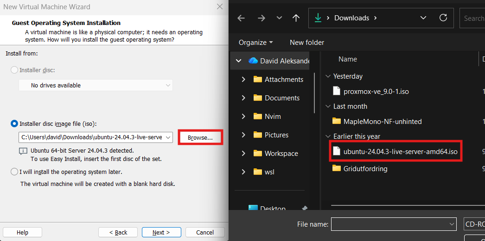
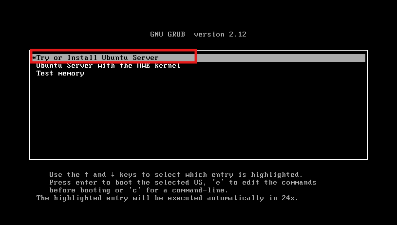
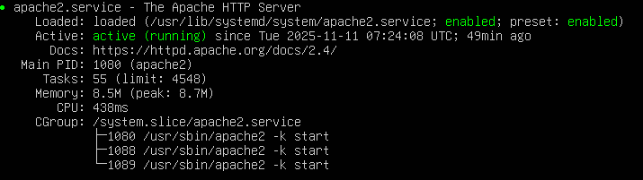

# Dokumentasjon for individuell oppgave

## Mål og hensikt

Mplet med prosjektet var å lage en nettside med HTML, CSS og JavaScript som viser hva jeg kan om webutvikling. Jeg ville lære mer om responsivt design, og hvordan man bruker Git og GitHub sammen med en Apache-server.

## Planlegging

### Utstyr
Windows 11, VMWare, Ubuntu-server, Apache2, VSCode, NVIM og GitHub

### Brukere
Lokal bruker med sudo tilgang

### Sikkerhet
Jeg brukte SSH for trygg overføring, og repoet på GitHub er offentlig uten skrivetilgang.

## Gjennomføring

### Oppsett av ubuntu server

Jeg begynte med å laste ned iso filen til ubuntu server her:

    https://ubuntu.com/download/server

Deretter åpnet jeg VMWare og trykket "CTRL + N" for å lage en ny virtuell maskin.

Jeg trykket "next" til jeg kom til der jeg er på bildet under, der valgte jeg "Installer disc image" og trykte på "Browse". Til slutt valgte jeg ISO filen jeg lastet ned.

Jeg trykte "Next" og "Finish" til vinduet lukket seg, så ventet jeg til jeg fikk valget vist på bildet under, jeg valgte "Try or install ubuntu server"

Resten av installasjonen var ganske rett fram, det eneste jeg forandret på var tastaturoppsett og valget om å installere ssh server, det er det jeg bruker til å få flyttet nettsidemappen inn på den virtuelle maskinen.

Til slutt kjørte jeg disse kommandoene for å installere apache serveren og å sjekke om den kjører:

    sudo apt install apache2

    sudo systemctl status apache2

Den andre kommandoen returnerte dette så da visste jeg at det fungerte

### Utvikling av nettsiden

Jeg begynte med å sette opp HTML filer og navigasjonsbaren, så la jeg inn innhold. CSS filen jobbet jeg med under hele prosjektet samtidig som jeg utviklet den. Til slutt la jeg til et spill på "Hjem" siden, jeg hadde tenkt til å legge til flere så det er mange tomme knapper, men jeg undervurderte hvor mye arbeid det kom til å være.

Nettsiden består av en hjemmeside med minispill, og flere undersider, disse er Om, KI bruk og Kontakt som man kan navigere til i navigasjonsbaren oppe til høyre.

Jeg brukte KI til repetetiv kode, feilsøking og til å hjelpe meg med å bruke Git. Alt jeg brukte KI til var ting jeg kunne og hadde gjort allerede.

## Resultat og testing

Alle sidene fungerer bra på alle skjermstørrelsene untatt stein saks papir spillet, siden jeg brukte samme CSS fil på alle sidene og spillet var så annerledes oppbygget fungerte ikke den på mindre skjermer, siden prosjektet allerede ble litt større enn jeg tenkte så valgte jeg å ikke fikse dette.

Git og Apache-serveren fungerte

## Vedlikehold og forbedring

Nettsiden ligger på GitHub og oppdateres med git push og git pull

Her er en liste på ting jeg hadde forbedret hvis jeg hadde hatt bedre tid.

1. Fikse CSS på stein saks papir spillet på mindre skjermer

2. Det er lett å legge til flere spill

3. 